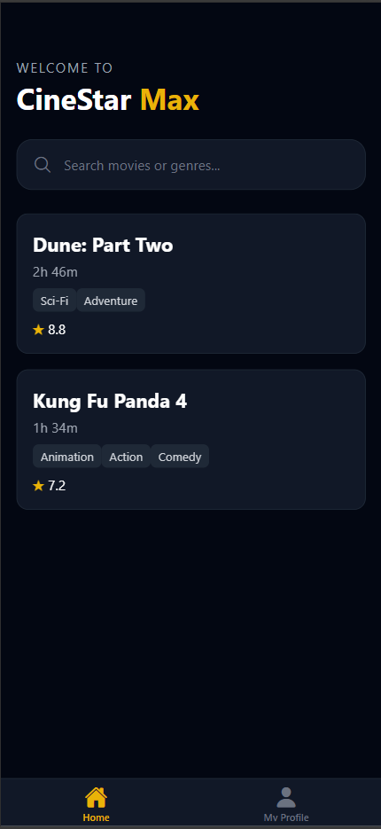
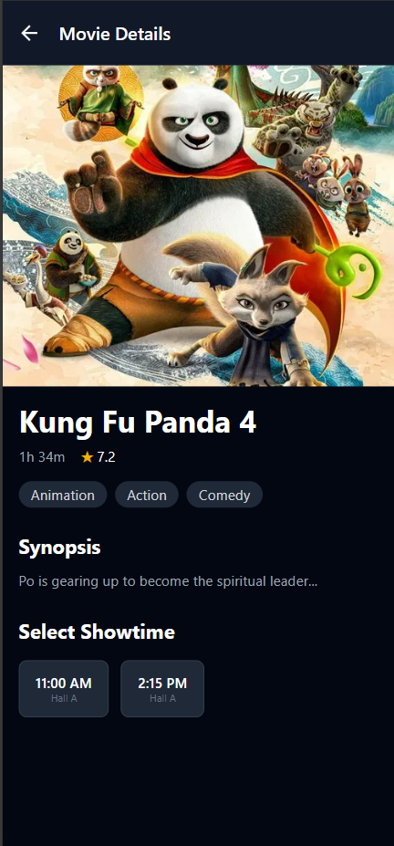
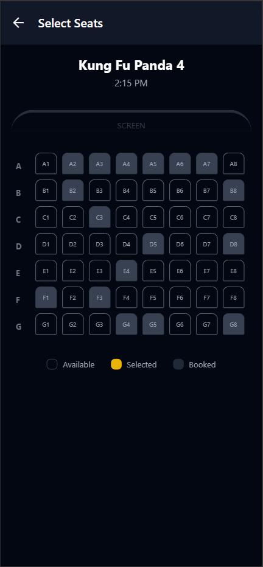
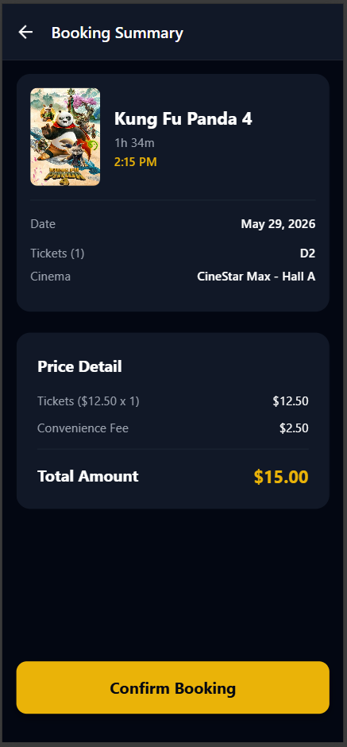
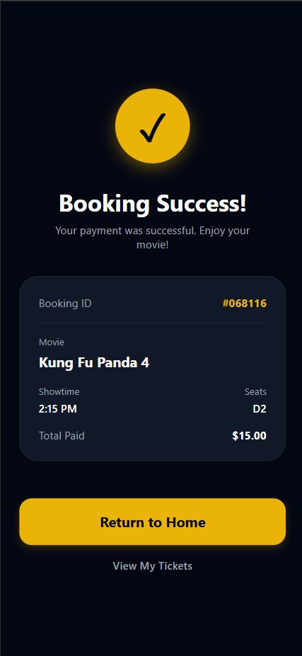
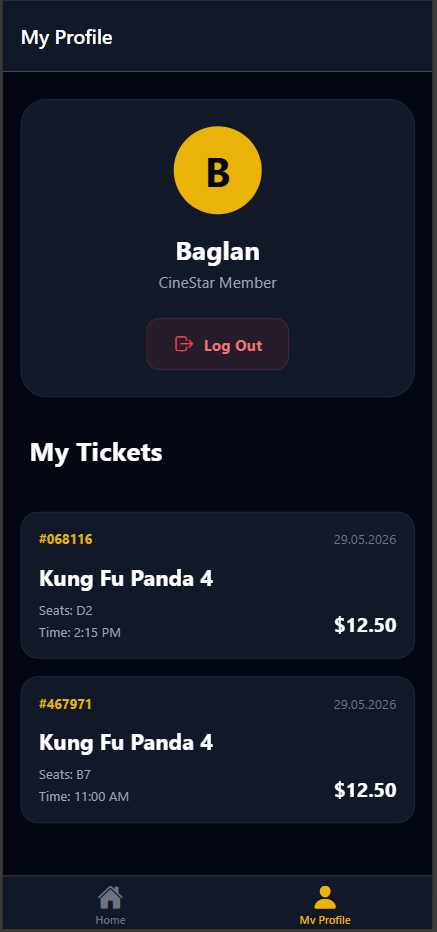

# CineStar Max - Movie Ticket Booking App 🍿🎟️

CineStar Max is a beautiful, full-stack React Native movie ticket booking application designed with a dark, premium aesthetic. It offers a seamless experience for users to browse trending movies, select their preferred showtimes, and book specific seats—all securely powered by a custom Node.js and PostgreSQL backend.

## ✨ Key Features
- **Secure Authentication**: User registration and login powered by JSON Web Tokens (JWT) and encrypted passwords (bcryptjs).
- **Dynamic Seat Selection**: An interactive theater layout grid that updates seat availability in real-time.
- **Premium UI/UX**: Slick dark mode design built using NativeWind (TailwindCSS for React Native), featuring dynamic animations and a modern tab-based navigation flow.
- **Detailed Order Summaries**: Detailed breakdown of tickets, convenience fees, and total pricing before finalizing a transaction.
- **Ticket History**: A personalized `Profile` tab where users can view logic their past ticket purchases.
- **Search Capabilities**: Instantly search for currently playing movies by title or genre.

## 📱 Screenshots

*(Place your screenshots in a folder named `screenshots` next to this README file, and their images will appear below!)*

  
  
  
  
  
  

## 🛠️ Tech Stack
- **Frontend**: React Native, Expo Router, NativeWind (Tailwind CSS)
- **Backend**: Node.js, Express, PostgreSQL
- **Auth & State**: AsyncStorage, JWT, React Context API

---
*Built as a showcase for a complete, end-to-end mobile booking system.*
